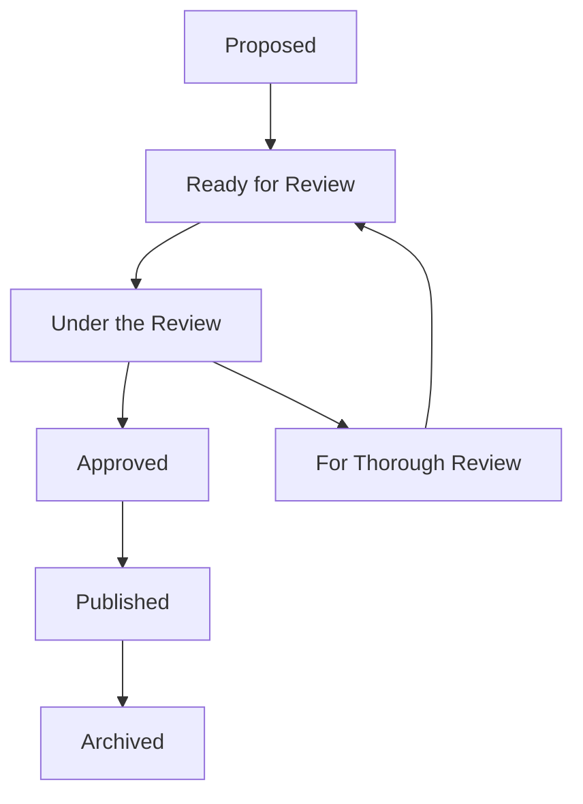

# 🛠️ Definition Processing Workflow

A structured workflow for capturing, enriching, reviewing, validating, and publishing ITS data definitions.

---

## 🔁 Status Labels & Transition Logic

| Status         | Description                                  | 
|----------------|----------------------------------------------|
|      | Initial definition captured for enrichment, initial development is here   |
|  | staging status, after initial enrichment of the draft definition         |
|  | Being peer-reviewed or expert-evaluated      |
|      | Finalised concept definition 				|
|     | No consensus reached, needs further developments               | 
|      | Deprecated or replaced concept               | 

## Drafting the definition

### 📥 1. Initial Capture

- Source definitions from trusted materials.
- Assign status → .
- Create metadata fields:  
  `source`, `category`, `subcategory`, `id`, `definition`, `status`.

### 🔍 2. Refinement Tasks

- Reword for precision and clarity.
- Normalize terminology to domain standards.

### 📝 3. Explanatory Additions

- Provide background context.
- Include example usage and edge cases.
- Clarify assumptions or constraints.
- Add visual aids or code samples when helpful.

- Change status to → .

## 👥 3. Peer Review Workflow

- Change status to → .
- Reviewers may suggest edits or approve.
- Resulting status becomes:
  -  if approved after all proposed changes
  -  if no consensus was reached in the review process and dictionary item needs further elaboration
  -  if the item is deprecated, by e.g. new definitions in updated laws

Track revisions via commit history or comments in issues.

## 🌍 4. Publishing & Discovery

- Release finalized definitions → `release/DR_*.md`
- Generate semantic vocab → `vocab/<DR>/<item>.ttl`
- Publish via GitHub Actions as versioned artifacts.

## 🔄 5. Change Management

- Any update starts from status → .
- From [for thorough review](https://img.shields.io/badge/for_thorough_review-ff9800), after further elaboration dictionary items go to ![ready for review].
- Retired concepts receive status → .
- Maintain changelog entries per definition.
- Track rollback versions via git history.

## 🌐 Visual Workflow

